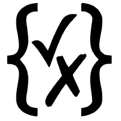

<aside class="notes">
Shhh, these are your private notes 📝
</aside>

---

## Fabian Morón Zirfas

* Senior Creative Technologist
* @Ideation & Prototyping Lab
* @Technologiestiftung Berlin
* GitHub: @ff6347

<aside class="notes">

Jack of all Trades Master of None.

Ganz offiziel bin ich Kommunikations Designer & Kaufmann, bin aber im Laufe meine
Karriere immer weiter in die Bereiche Dev Ops und Full Stack eingetaucht.

</aside>

## Lucas Vogel

* TODO

<aside class="notes">


</aside>

# T.O.C.

* Tech Stack Übersicht
* Konvention vor Konfiguration
* Dokumentation
* Qualitätssicherung


<aside class="notes">

Wenn wir zu schnell sind sagt uns Bescheid oder wenn wir etwas anders erklären soll.
Eine Diskussion können wir gerne im QA führen.

</aside>

## Online Präsentation

[technologiestiftung.github.io/stadtpuls-behind-the-curtain](https://technologiestiftung.github.io/stadtpuls-behind-the-curtain)

<aside class="notes">

Speaker: Fabian

Die Präsentation findet ihr auch online hinter diesem Link.

</aside>

# Tech Stack Übersicht

---


<aside class="notes">

Speaker: Fabian

Von Links

Frameworks:

* Next.js Frontend (React.js) deployed auf vercel.com
* Fastify.js Backend (Node.js) deployed auf render.com
* Beide sprechen mit Supabase

BTW (ich habe ein wenig gecheated)

</aside>


---


# Konvention vor Konfiguration

<aside class="notes">

Speaker: Lucas

</aside>

## Große Community


<aside class="notes">

Speaker: Lucas

React, Fastify, Postgres, etc
Discord gruppen, Github Discussions, Gists, Stackoverflow, etc.

</aside>

## Viele Resourcen

<aside class="notes">

Speaker: Lucas

Artikeln, Newsletters, Coder websites, ...
Tutorials: Youtube, Egghead, codecademy, ...

</aside>

## Open Source/Core


<aside class="notes">

Speaker: Fabian

Was ist so cool an Open Source Software und Open Core Produkten?

Am Beispiel Supabase

</aside>

---

## Backend as a Service Startup 

> Supabase is an open source Firebase alternative.

<aside class="notes">

Selber sagen sie von sich sie seien eine OS Firebase alternative.

Supabase ist ein Open Source Open Core Startup aus USA CA welches komplett remote arbeitet.
Die Supabase ist noch in public Beta das bereits $30 Millionen Series A Funding erhalten hat

</aside>


---


<aside class="notes">

Speaker: Fabian 


* Kong (API Gateway)
* GoTrue (Auth System by Netlify)
  * mit Authentication System (Bist du du?)
* PostgREST (REST API for postgres DB ohne eine Zeile Code)
* Realtime (Elixir mit Phoenix Framework)
  * mit Realtime Pub/Sub (Postgres Changes -> Websocket)
* mit Storage (AWS S3?)
* pg-meta (Custom Postgres DBs Management API)
* Postgres (DB mit nem Haufen Extensions)
  * mit Authorization via Postgres RLS (Darfst du das?)
* mit SDKs für JS (offiziel) + C#, Python, Rust, Kotlin, Dart community
* bald mit serverless functions

* Alles was das Core Produkt ausmacht ist OSS
* Selbst wenn Google morgen alles kauft
  und abschaltet kann ich den Tech Stack weiter verwenden

</aside>

# Dokumentation


<aside class="notes">

Speaker: Lucas

* Typescript
* Storybook

Speaker: Fabian

* Fastify JSON Schemas


</aside>

## Typescript

<aside class="notes">

Speaker: Lucas

* Dokumentiert Funktionen & Variabeln
* Warnt vor mögliche Fehlern
* Bietet Autovervollständigung

</aside>

## Fastify JSON Schemas



<aside class="notes">

Speaker: Fabian

Unser Backend Framework "Fastify" ist nicht nur schnell, wie der Name impliziert,
sondern bietet auch eine ein gute DX.

Durch JSON Schemas können HTTP Anfragen validiert werden.
Vorteile sind:

- Keine Fleissarbeit im validieren von Request Bodies, Headern, Parametern oder Querystrings
- Keine Fleissarbeit im schreiben von Error Handlern
- Dokumentation der Möglichkeiten einer Route in Code

</aside>

## Bsp.: JSON Schema

```json
{
  "$id": "https://example.com/cat.schema.json",
  "title": "cat",
  "type": "object",
  "properties": {
    "name": {
      "type": "string",
      "description": "The cat's name."
    },
    "mood": {
      "description": "The mood the cat is in.",
      "enum": ["grumpy", "happy", "purrrr!"]
    }
  },
  "required": ["mood"]
}
```

## Bsp.: JSON

```json
{
  "name": "Mister Fuzzyboots",
  "mood": "purrrr!"
}
```

## Storybook

<aside class="notes">

Speaker: Lucas

* Gibt ein Überblick über alle verfügbare Komponente
* Responsive Styles / Größe, etc.
* Parameters und Props

</aside>

# Qualitätssicherung

<aside class="notes">

Speaker: Lucas

</aside>

## Testing

* Unit-testing
* Snapshot-testing
* Integration-testing

<aside class="notes">

Speaker: Lucas

* Unit-testing: Überprüft die interne logik (aka. Business logic) 
* Snapshot-testing: Warnt vor unerwartete Änderungen
* Integration-testing: Repliziert Production Umstände und sichert zusammenhand

</aside>

## Storybook

<aside class="notes">

Speaker: Lucas

* Lässt in isolation testen und entwickeln
* Kann für snapshot testing verwendet werden

</aside>

## Code Reviews

<aside class="notes">

Speaker: Fabian

Da wir als Team an der gleichen Codebase arbeiten ist es hilfreich auch das Team 
zu allen Änderungen am Code zu konsultieren.

Sei es:

* Fixes
* Features
* Refactoring

Es geht vornehmlich darum

* eine gemeinsame Code-Qualität zu erhalten und aber auch
* Fehler zu sehen die CI/CD oder Testing nicht sehen.

Ein weiterer Effekt ist, dass das Teammitglider so auch Einblick in Bereiche der Applikation erhält
an denen sie selber gar nicht arbeiten.

</aside>

## Github Actions

Bei jeder PR/Push

<aside class="notes">

Speaker: Fabian

Zu den Codereviews lassen wir bei jedem Pull Request und auch Push zu einem Branch
alle Tests auf dem CI/CD System laufen. Wenn ein Test Fehler wirft wird auch nicht gemerged.

Kein: Works on my Machine!

</aside>

## Staging Environments

<aside class="notes">

Speaker: Fabian

Des weiteren haben wir die gesamte Applikation dupliziert und können alle neuen Features
online testen.

Kein "Testing in Production"

</aside>

# Q & A


# Danke

für Ihre Aufmerksamkeit