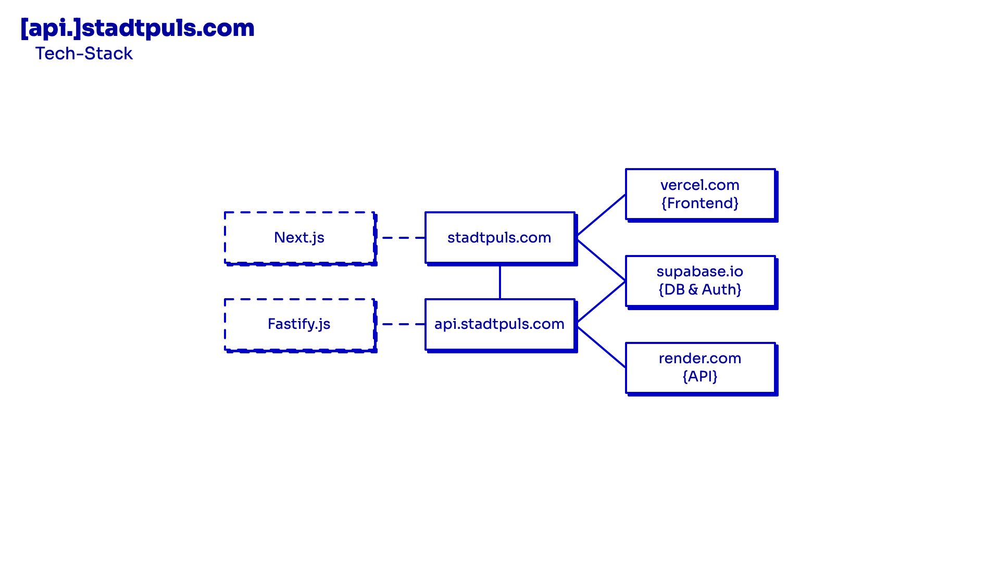
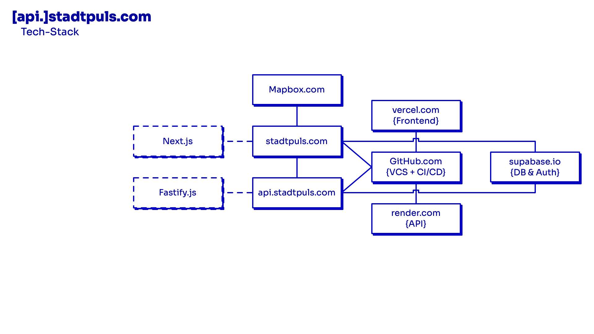
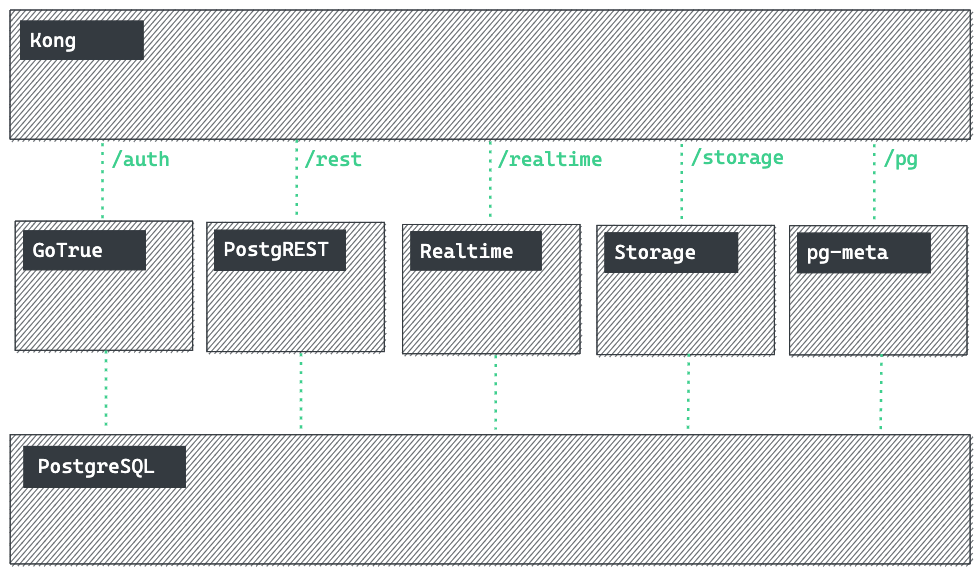

<aside class="notes">
Shhh, these are your private notes 📝
</aside>

---

## Fabian Morón Zirfas

* Senior Creative Technologist
* @Ideation & Prototyping Lab
* @Technologiestiftung Berlin
* GitHub: @ff6347

<aside class="notes">

Jack of all Trades Master of None.

Ganz offiziel bin ich Kommunikations Designer & Kaufmann, bin aber im Laufe meine
Karriere immer weiter in die Bereiche Dev Ops und Full Stack eingetaucht.

</aside>

# T.O.C.

* Der Stadtpuls Tech Stack!
* WzT Supabase?
* Warum Supabase?
* Q & A

<aside class="notes">
Wenn ich zu schnell bin sagen sie mir Bescheid oder wenn ich etwas anders erklären soll.
Eine Diskussion können wir gerne im QA führen.
Die Präsentation finden Sie auch online hinter diesem Link.

</aside>

## Der Stadtpuls Tech Stack

---

<aside class="notes">
Von Links

Frameworks:

* Next.js Frontend (React) deployed auf vercel.com
* Fastify.js Backend (Node.js) deployed auf render.com
* Beide sprechen mit Supabase

BTW (ich habe ein wenig gecheated)
</aside>

---

## Was zum Teufel (WzT) ist

<aside class="notes">
Da stellt sich die Frage WzT
</aside>

---

> Supabase is an open source Firebase alternative.

<aside class="notes">
Selber sagen sie, sie sind eine Firebase alternative.

</aside>

## Open Source/Open Core
### B.a.a.S.\* Startup

 
 
 

\* Backend as a Service

<aside class="notes">

Supabase ist ein Open Source Open Core Startup aus USA CA welches komplett remote arbeitet.
Die Supabase ist noch in public Beta das bereits $30 Millionen Series A Funding erhalten hat

</aside>

---

<aside class="notes">

* Kong (API Gateway)
* GoTrue (Auth System by Netlify)
* Realtime (Elixir mit Phoenix Framework)
* PostgREST (Automitische REST API for postgres DB)
* pg-meta (Custom Postgres DBs Management API)
* Postgres (DB mit nem Haufen Extensions)
  
</aside>

## Batteries Included

<aside class="notes">

Supabase kommt

* mit einer API für die DB (ohne eine Zeile Code)
* mit SDKs für JS (offiziel) + C#, Python, Rust, Kotlin, Dart community
* mit Authentication System (Bist du du?)
* mit Authorization via Postgres RLS (Darfst du das?)
* mit Storage (AWS S3?)
* mit Realtime Pub/Sub (Postgres Changes -> Websocket)
* bald mit serverless functions

</aside>

## Warum Supabase?

<aside class="notes">

* Alles was das Core Produkt ausmacht ist OSS
* Selbst wenn Google morgen alles kauft
  und abschaltet kann ich den Tech Stack weiter verwenden

</aside>

# Q & A

# Danke

für Ihre Aufmerksamkeit