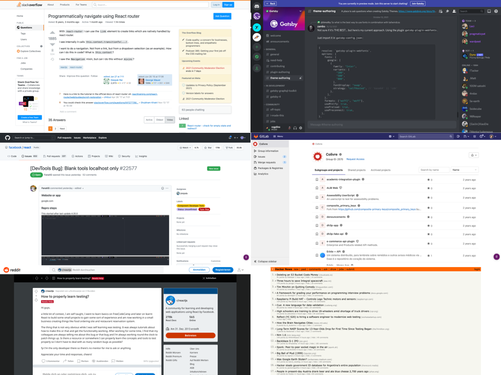
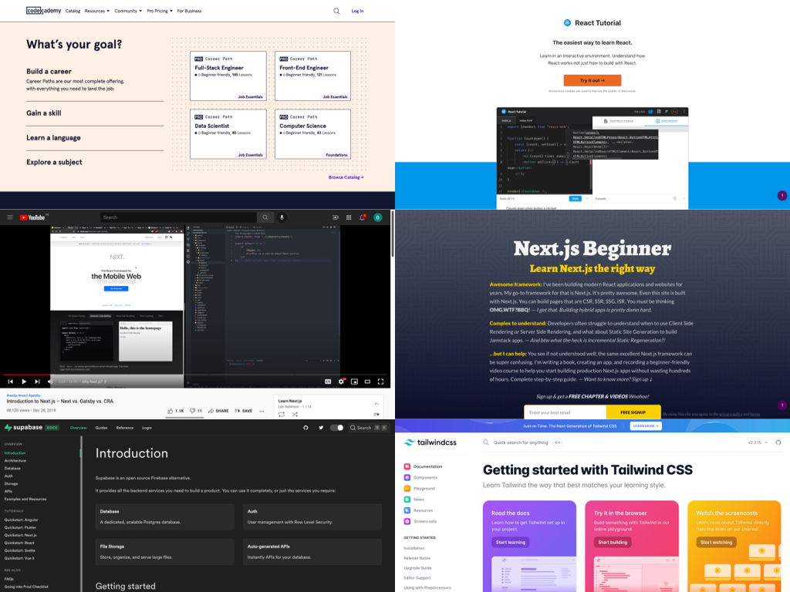
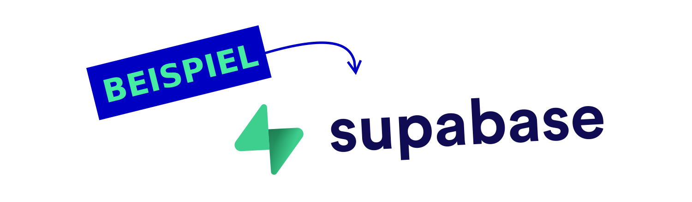
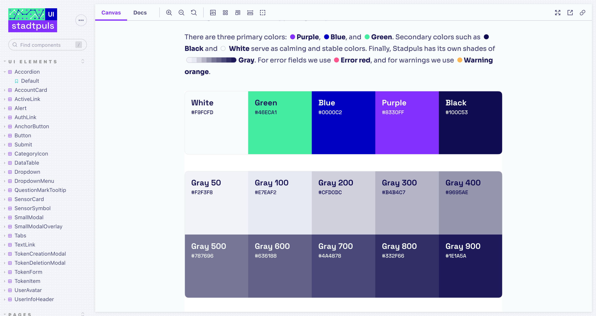
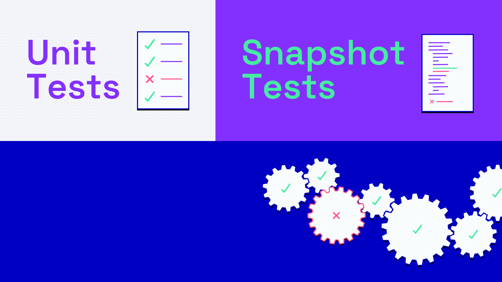
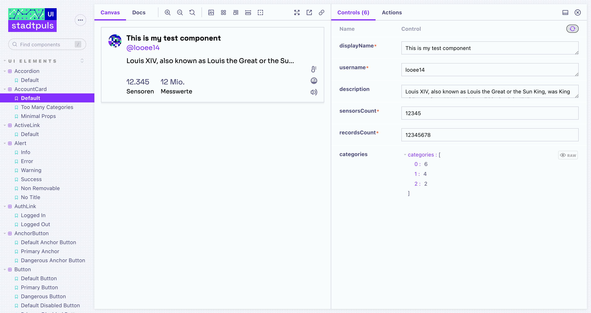
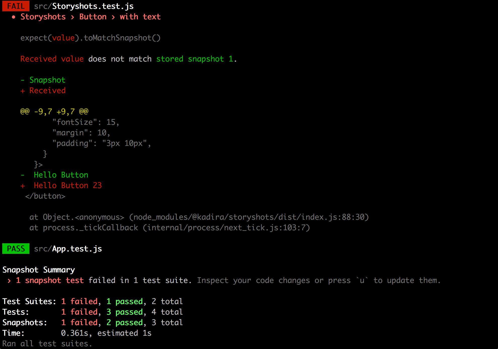
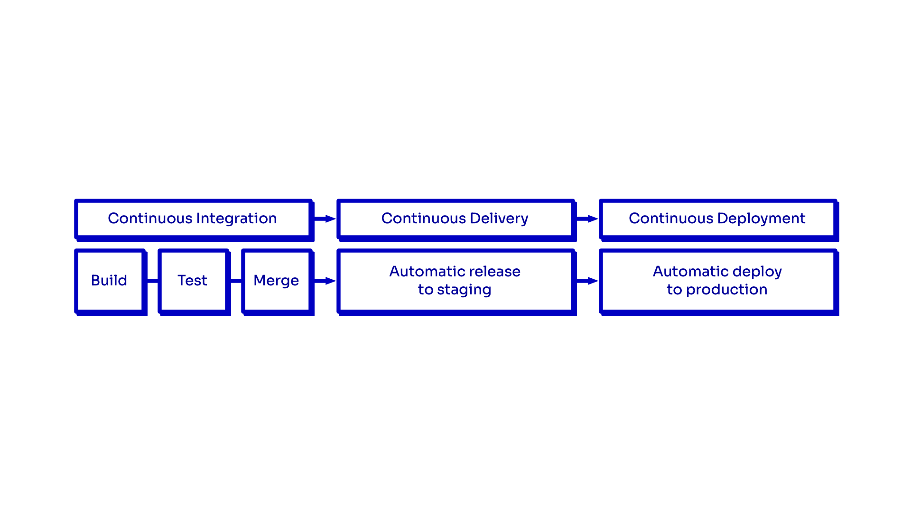
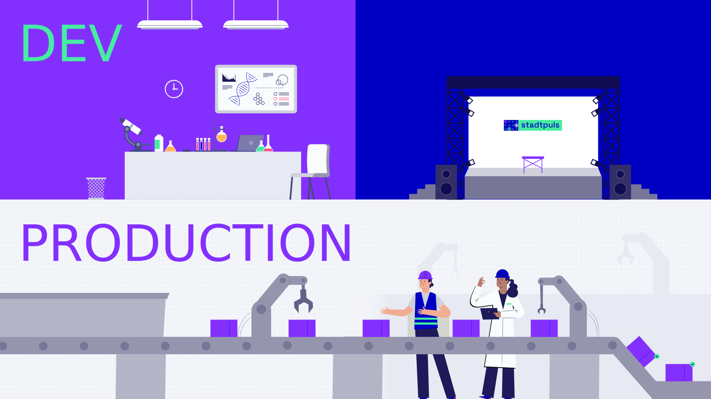

<aside class="notes">

Speaker: Fabian

Stadtpuls, Stadtpuls, Stadtpuls und Stadtpuls
</aside>

---

## Fabian Morón Zirfas

* Senior Creative Technologist
* @Ideation & Prototyping Lab
* @Technologiestiftung Berlin
* GitHub: @ff6347

<aside class="notes">

Jack of all Trades Master of None.

Ganz offiziel bin ich Kommunikations Designer & Kaufmann, bin aber im Laufe meine
Karriere immer weiter in die Bereiche Dev Ops und Full Stack eingetaucht.

An -> Lucas

</aside>

## Lucas Vogel

* UI/UX Designer & Frontend Developer
* @CityLAB Berlin
* @Technologiestiftung Berlin
* GitHub: @vogelino

<aside class="notes">

* Aus der Schweiz & Chile
* In Berlin seit 10 Jahre
* Im CityLAB seit Februar

An -> Fabian
</aside>

# T.O.C.

* Stadtpuls Tech Stack
* Konvention vor Konfiguration
* Dokumentation
* Qualitätssicherung


<aside class="notes">

Speaker: Fabian

Wenn wir zu schnell sind sagt uns Bescheid oder wenn wir etwas anders erklären soll.
Eine Diskussion können wir gerne im QA führen.

</aside>

## Online Präsentation

[technologiestiftung.github.io/stadtpuls-behind-the-curtain](https://technologiestiftung.github.io/stadtpuls-behind-the-curtain)

<aside class="notes">

Die Präsentation findet ihr auch online hinter diesem Link.

</aside>

# Stadtpuls Tech Stack

---


<aside class="notes">

Bevor wir in unsere Topics abtauchen wollten wir kurz einen Übrblick geben
welche Technologien hinter Stadtpuls stehen.

Von Links

Frameworks:

* Next.js Frontend (React.js) deployed auf vercel.com
* Fastify.js Backend (Node.js) deployed auf render.com
* Beide sprechen mit Supabase

</aside>

---


<aside class="notes">

BTW (ich habe ein wenig gecheated im Chart)

* Wir haben noch GitHub als VCS & CI/CD mit drin
* und Mapbox als Kartenprovider
  
Ohne sieht es aber schicker aus ;)

An -> Lucas

</aside>

# Worauf wir achten, wenn wir Technologien auswählen

<aside class="notes">

Speaker: Lucas

* Keine Custom Frameworks (Don't reinvent the wheel)
* Keine Homebrew UI Libraries (Aber eigene UI Komponenten)
* Generalisierte und weit verbreitete Tools

erlauben schnellere Adaption und Onboarding

</aside>

## Große Communities



<aside class="notes">

Etablierte und weit verbreitete tools:
- React, Fastify, Postgres, etc

Große Community und Orte, um Antworten zu finden:
- Discord gruppen, Github Discussions, Gists, Stackoverflow, etc.

</aside>

## Viele Resourcen



<aside class="notes">

Artikeln, Newsletters, Coder websites, ...
Tutorials: Youtube, Egghead, codecademy, ...

An -> Fabian

</aside>

## Open Source/Core



<aside class="notes">

Speaker: Fabian

Klar wir nehmen Open source wo wir können.

Aber warum?
Weil es kostenlos ist? (Spoiler Nein)
Was ist so cool an Open Source Software und Open Core Produkten?

Schaune wir uns das mal an am Beispiel Supabase:

</aside>

---

## Backend as a Service Startup 

> Supabase is an open source Firebase alternative.

<aside class="notes">

Selber sagen sie von sich sie seien eine OS Firebase alternative.

Supabase ist ein Open Source Open Core Startup aus USA CA welches komplett remote arbeitet.
Die Supabase ist noch in Public Beta haben aber bereits $30 Millionen Series A Funding erhalten hat

</aside>


---


<aside class="notes">

* Kong (API Gateway)
* GoTrue (Auth System by Netlify)
  * mit Authentication System (Bist du du?)
* PostgREST (REST API for postgres DB ohne eine Zeile Code)
* Realtime (Elixir mit Phoenix Framework)
  * mit Realtime Pub/Sub (Postgres Changes -> Websocket)
* mit Storage (AWS S3?)
* pg-meta (Custom Postgres DBs Management API)
* Postgres (DB mit nem Haufen Extensions)
  * mit Authorization via Postgres RLS (Darfst du das?)
* mit SDKs für JS (offiziel) + C#, Python, Rust, Kotlin, Dart community
* bald mit serverless functions

* Alles was das Core Produkt ausmacht ist OSS
* Selbst wenn Google morgen alles kauft
  und abschaltet kann ich den Tech Stack weiter verwenden

An -> Lucas

</aside>

# Dokumentation


<aside class="notes">

Speaker: Lucas

* Warum ist Dokumentation wichtig?
* Wie erstellen wir Dokumentation?

Schriftliche Dokumentation ist oft eine Bürde für Entwickler.

* Sie wird im Nachhinein geschrieben (oder auch nicht)
* Sie wird vorab geschrieben (und stimmt dann nicht mehr mit der App überein)

Andere Ansätze sind zB auch README Driven Development

</aside>

## JavaScript...

```js
export const SigninButton= (props) => {
  return <><button onClick={
    (e) => {
    e.preventDefault();
    console.log(props.email, props.password);
  }}/></>
}


```
<!-- SPACE OBEN LASSEN - Sorgt dafür, dass die slides nicht so springen -->

<aside class="notes">

Speaker: Lucas

Javascript dokumentiert nicht der code: 

* Woher weiss ich welche Typen meine props bekommen sollten?

</aside>

## ...Versus Typescript

```jsx
interface SigninProps {
  email: string;
  password: string;
}
export const SigninButton: React.FC<SigninProps> = ({
  email, password
}) => {
  return <><button onClick={
    (e: React.ChangeEvent<any>) => {
    e.preventDefault();
    console.log(email, password);
  }}/></>
}
```

<aside class="notes">


Speaker: Lucas

Static Typechecking erlaubt: 

* Dokumentiert Funktionen & Variabeln
* Warnt vor mögliche Fehlern
* Bietet Autovervollständigung

An -> Fabian

</aside>

## Fastify JSON Schemas


<aside class="notes">

Speaker: Fabian

Unser Backend Framework "Fastify" ist nicht nur schnell, wie der Name impliziert,
sondern bietet auch eine ein gute DX.

Durch JSON Schemas können HTTP Anfragen validiert werden.
Vorteile sind:

* Keine Fleissarbeit im Validieren von Request Bodies, Headern, Parametern oder Querystrings
* Keine Fleissarbeit im Schreiben von Error Handlern und Error Responses
* Dokumentation der Möglichkeiten/Anforderungen eines Endpoints in Code

</aside>

## JSON Schema

POST http://example.com/api/cats

```json
{
  "$id": "https://example.com/api/cats.schema.json",
  "title": "cats",
  "type": "object",
  "additionalProperties": false,
  "properties": {
    "name": {
      "type": "string",
      "description": "The cat's name."
    },
    "mood": {
      "description": "The mood the cat is in.",
      "enum": ["grumpy", "happy", "purrrr!"]
    }
  },
  "required": ["mood"]
}
```

<aside class="notes">

Hier ein Beispiel Schema für meine fiktive Katzen API

Dieses JSON beschreibt:

* Welche Eigenschaften erlaubt sind
* Welche Eigenschaften vorgeschrieben sind
* Welche Möglichkeiten für zB mood zur Verfügung stehen
* Das keine zusätzlichen Eigenschaften erlaubt sind

</aside>

## Request 201

```http
POST /api/cats HTTP/1.1
Host: example.com
Content-Type: application/json

{"mood": "purrrr!"}
```

<aside class="notes">

Dies wäre ein POST Request der diesem Schema entspricht.
Somit bekommen wir ein 201 zurück und alles ist gut.

</aside>


## Request 400

```http
POST /api/cats HTTP/1.1
Host: example.com
Content-Type: application/json

{"mood": "purrrr!", "saz": "I hate Mondays!"}

```

```json
{
  "statusCode": 400,
  "error": "Bad Request",
  "message": "body should NOT have additional properties"
}
```
<aside class="notes">

Wenn das Schema auf eine Route angwandt ist würde uns Fastify eine 400 Response senden.
All das passiert, ohne dass ich eine spezielle Funktion schreibe die den Body validiert.

An -> Lucas

</aside>


## Storybook



<aside class="notes">

Speaker: Lucas

* Gibt ein Überblick über alle verfügbare Komponente
* Responsive Styles / Größe, etc.
* Parameters und Props

</aside>

# Qualitätssicherung

<aside class="notes">

Speaker: Lucas

</aside>

---



<aside class="notes">

Speaker: Lucas

* Unit-testing: Überprüft die interne logik (aka. Business logic) 
* Snapshot-testing: Warnt vor unerwartete Änderungen
* Integration-testing: Repliziert Production Umstände und sichert zusammenhand

</aside>

## Storybook



<aside class="notes">

Speaker: Lucas

* Lässt in isolation testen und entwickeln

</aside>

## Storybook (Snapshot testing)



<aside class="notes">

Speaker: Lucas

* Storybook Snapshots warnt vor unerwünschte UI-Veränderungen

An -> Fabian

</aside>

## Code Reviews


<aside class="notes">

Speaker: Fabian

Da wir als Team an der gleichen Codebase arbeiten ist es hilfreich auch das Team 
zu allen Änderungen am Code zu konsultieren.

Sei es:

* Fixes
* Features
* Refactoring

Es geht vornehmlich darum

* eine gemeinsame Code-Qualität zu erhalten und aber auch
* Fehler zu sehen die CI/CD oder Testing nicht sehen.

Ein weiterer Effekt ist, dass das Teammitglider so auch Einblick in Bereiche der Applikation erhält
an denen sie selber gar nicht arbeiten und damit der BUS Faktor reduziert wird.


</aside>

## Github Actions

* CI (Continuous Integration)
* CD (Continuous Delivery)
* CD (Continuous Deployment)

---



<aside class="notes">

* CI  Continuous Integration. Zu den Codereviews lassen wir bei jedem Pull Request und auch Push zu einem Branch
alle Tests + builds via GitHub Actions laufen. Wenn ein Test Fehler wirft wird auch nicht gemerged.
* CD Continuous Delivery. Wennn alles geht und der Codereviews auch passt kann in staging gemerged werden
* CD Continuous Deployment. Sobald auf staging alles gut aussieht kann in main gemerged werden und
  die Applikationen wird automatisch zu render.com oder vercel.com deployed und ist live in production

Kein: Works on my Machine!

</aside>

---



<a href='https://www.freepik.com/vectors/music'>Music vector created by freepik, </a>
<a href='https://www.freepik.com/vectors/process'>Process vector created by stories, </a>
<a href='https://www.freepik.com/vectors/technology'>and Technology vector created by freepik - www.freepik.com</a>

<aside class="notes">

Des weiteren haben wir die gesamte Applikation dupliziert und können alle neuen Features
online testen bevor wir sie in Production senden.

Kein "Testing in Production"

</aside>

# Q & A
# Danke

für Ihre Aufmerksamkeit